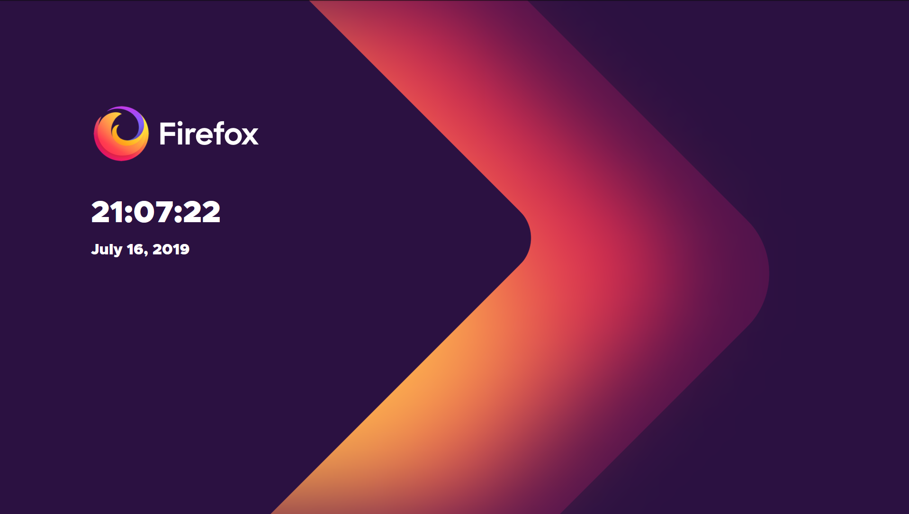

# Firefox Brand Styled New Tab

[Firefox Addon](https://addons.mozilla.org/en-US/firefox/addon/new-brand-tab/) |
 [Github Page](https://eleosos.github.io/firefox-brand-newtab/) |
 [Github Page without clock and date](https://eleosos.github.io/firefox-brand-newtab/no-clock/)

This is a simple page styled similar to [Firefox's new brand identity](https://mozilla.design/firefox/) that shows a clock and the date. It was a fun project to use my CSS skills and to learn a bit more about Firefox extensions.

*Not optimized for mobiles.*

Tips and improvements are always welcome!

The [Metropolis](https://github.com/njugunagathere/Metropolis) font is licensed under the [SIL Open Font License](https://github.com/njugunagathere/Metropolis/blob/master/Open%20Font%20License.md).
